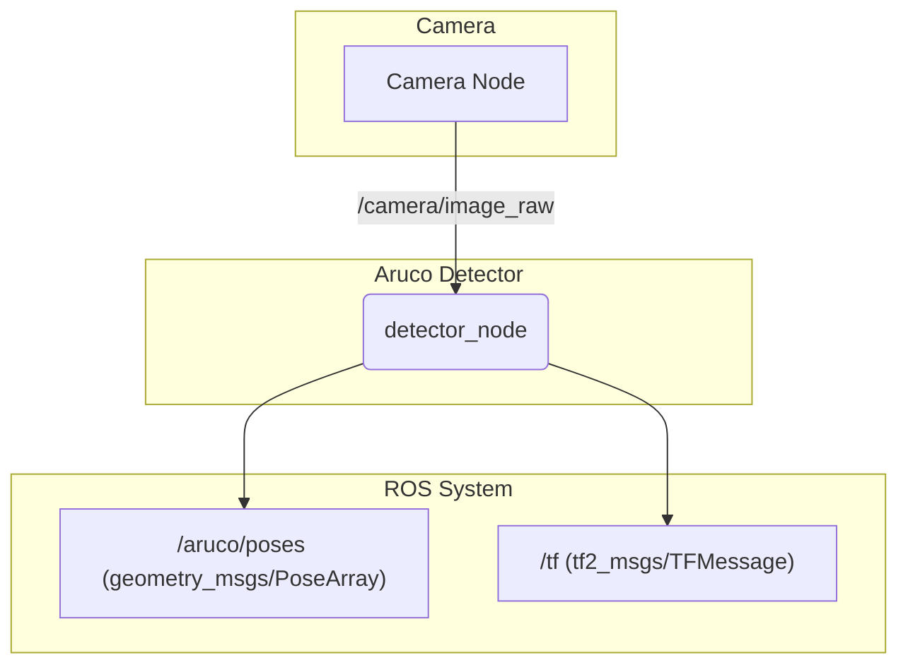

# ArUco Detector

This package provides a ROS 2 node to detect ArUco markers from a camera feed and publish their poses.

## How it Works

The `detector_node` subscribes to an image topic, performs ArUco marker detection using OpenCV, and then publishes the pose of each detected marker. It can also publish the TF2 transform for the markers.

-   **Input**: A raw or compressed image stream (e.g., `/camera/image_raw`).
-   **Processing**: Uses OpenCV's `cv::aruco` module to find markers in the image. Camera calibration parameters are required for accurate pose estimation.
-   **Output**:
    -   Publishes marker poses to a topic (e.g., `/aruco/poses`).
    -   Can publish detections as `vision_msgs/Detection3DArray`.
    -   Broadcasts a TF2 transform from the camera frame to each marker's frame.

## Example Usage



## How to Use

You will typically run this node as part of a launch file that also starts a camera driver.

A minimal way to run the node:

```bash
# Remap the image topic to your camera's output topic
ros2 run aruco_detector detector_node --ros-args -r image_topic:=/camera/image_raw
```

For pose estimation, you must provide a camera calibration file.

## External Resources

-   [OpenCV ArUco Detection](https://docs.opencv.org/4.x/d5/dae/tutorial_aruco_detection.html)
-   [ROS 2 TF2 Transformations](https://docs.ros.org/en/humble/Tutorials/Intermediate/Tf2/Introduction-To-Tf2.html)