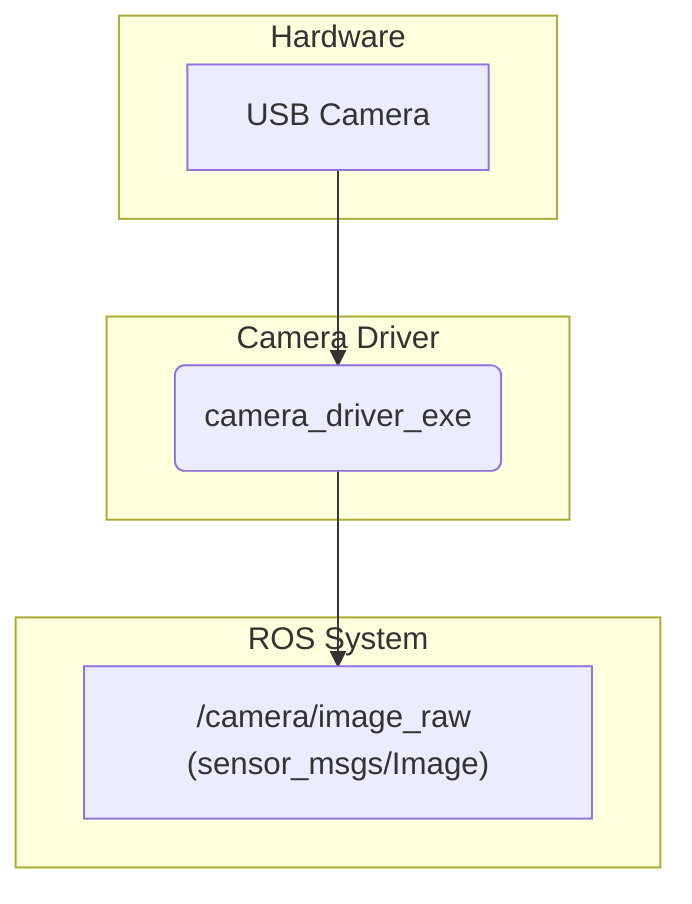

# camera_driver

This package provides a ROS 2 component for capturing video from a camera and publishing it as a ROS topic.

## How it Works

The `camera_driver_exe` node captures video from a specified camera device. It is a generic driver that can be configured via parameters in a launch file.

-   **Input**: A video device accessible by the system (e.g., a USB webcam).
-   **Processing**: It uses a backend library (like OpenCV) to connect to the camera, configure its resolution and frame rate, and capture frames.
-   **Output**: Publishes images to a ROS topic, typically as `sensor_msgs/Image` or `sensor_msgs/CompressedImage`.

## Example Usage

This driver is intended to be used within a launch file, where its parameters can be set.



## How to Use

This node is usually started from a launch file in a higher-level package like `mira2_perception`. Here is an example of how it might be launched:

```xml
<!-- Example from mira2_perception/launch/camera_1.launch -->
<launch>
    <arg name="vendor_id"     default="0x0c45"/>
    <arg name="product_id"    default="0x6366"/>
    <arg name="image_width"   default="1280"/>
    <arg name="image_height"  default="720"/>
    <arg name="framerate"     default="30"/>

    <node pkg="camera_driver"
          exec="camera_driver_exe"
          name="my_camera"
          output="screen">
        <param name="vendor_id"     value="$(var vendor_id)"/>
        <param name="product_id"    value="$(var product_id)"/>
        <param name="image_width"   value="$(var image_width)"/>
        <param name="image_height"  value="$(var image_height)"/>
        <param name="framerate"     value="$(var framerate)"/>
    </node>
</launch>
```

To run it manually, you would use `ros2 run`:

```bash
ros2 run camera_driver camera_driver_exe --ros-args -p device_path:="/dev/video0"
```

## External Resources

-   [ROS 2 `image_transport`](http://wiki.ros.org/image_transport)
-   [OpenCV Camera Capture](https://docs.opencv.org/4.x/d8/dfe/classcv_1_1VideoCapture.html)
