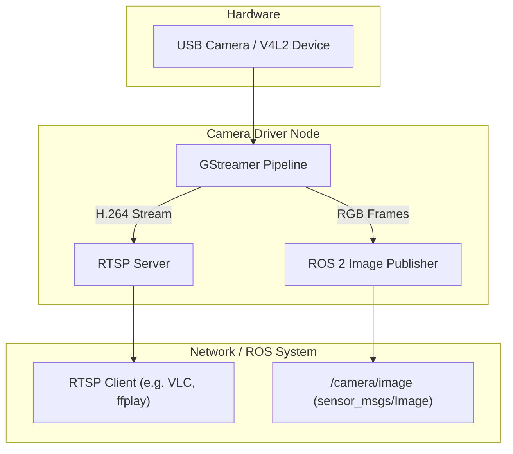

# camera_driver

This package provides a ROS 2 component for capturing video from a V4L2 camera device, streaming it via an RTSP server, and publishing it to a ROS 2 image topic simultaneously. It utilizes GStreamer for robust multimedia pipeline construction and hardware encoder auto-detection.

## How it Works

The `camera_driver_exe` node captures video from a specified camera device (e.g., a USB webcam). It automatically detects the best available hardware H.264 encoder (Intel QSV, NVIDIA NVENC, V4L2 M2M hardware encoders, or a software fallback like x264enc) to encode the stream efficiently. 

-   **Input**: A V4L2 video device accessible by the system (`/dev/video*`).
-   **Processing**: Uses a single GStreamer pipeline to connect to the camera, configure its resolution and frame rate, encode the video stream into H.264, and split the output. 
-   **Output**: 
    1. Streams the video over an RTSP server.
    2. Decodes the output and publishes uncompressed images to a ROS topic (as `sensor_msgs/Image`) alongside a `sensor_msgs/CameraInfo` topic.

## Example Usage

This driver is designed to be highly configurable via ROS parameters. 


```mermaid
graph TD
    subgraph Hardware
        A[USB Camera / V4L2 Device]
    end

    subgraph Camera Driver Node
        B[GStreamer Pipeline]
        C[RTSP Server]
        D[ROS 2 Image Publisher]
    end

    subgraph Network / ROS System
        E["RTSP Client (e.g. VLC, ffplay)"]
        F["/camera/image (sensor_msgs/Image)"]
    end

    A --> B
    B -->|H.264 Stream| C
    B -->|RGB Frames| D
    C --> E
    D --> F
```

## How to Use

The node can be configured via various parameters. It can search for a device by `device_path`, `usb_port`, or vendor/product ID.

```bash
# Example showing configuration with ROS 2 parameters
ros2 run camera_driver camera_driver_exe --ros-args \
    -p device_path:="/dev/video0" \
    -p image_width:=1280 \
    -p image_height:=720 \
    -p framerate:=30 \
    -p frame_format:= "MJPEG" \
    -p port:=8554 \
    -p bitrate:=2000 \
    -p camera_frame_id:= "my_camera_link" \
    -p ros_topic:= "my_camera"
```

Once running, you can connect an RTSP client to view the stream. The exact command will be printed in the node's output log, typically:
```bash
ffplay -fflags nobuffer -flags low_delay -framedrop -vf 'setpts=0' rtsp://<machine_ip>:8554/image_rtsp
```

## Architecture Notes

For better modularity, the node's logic is structured into:
- **Device Finding**: Logic to dynamically locate and match V4L2 devices by path, USB properties, or hardware IDs.
- **Pipeline Creation**: The logic to build the appropriate GStreamer string depending on the input format and hardware encoders available.
- **Node Execution**: Handling ROS 2 parameters, topics, and coordinating the RTSP server and GStreamer pipeline execution.

## External Resources

- [GStreamer Documentation](https://gstreamer.freedesktop.org/documentation/)
- [ROS 2 `image_transport`](http://wiki.ros.org/image_transport)