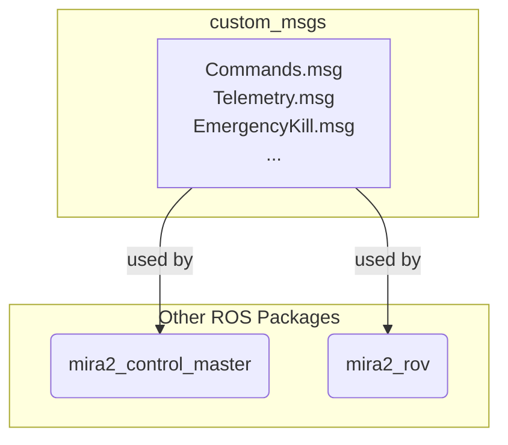

# custom_msgs

This package defines a set of custom ROS 2 messages used throughout the Mira2 project for communication between nodes.

## How it Works

This is an interface package containing `.msg` files. The ROS 2 build system uses these definitions to generate the necessary C++ and Python code for other nodes to use these message types.

## Example Usage

This package is a dependency for other nodes that need to communicate using these custom types.



## Defined Messages

-   **`Commands.msg`**: Sent to the ROV's master controller to command its movement.
    -   `bool arm`: Arm or disarm the vehicle.
    -   `string mode`: Flight mode (e.g., "STABILIZE").
    -   `int16 forward, lateral, thrust, pitch, roll, yaw`: PWM values for movement axes.
    -   `int16 servo1, servo2`: PWM values for auxiliary servos.

-   **`Telemetry.msg`**: A comprehensive message published by the master controller, containing sensor data and state information.
    -   Includes battery voltage, arm status, IMU (gyro, accelerometer, compass), orientation (quaternion, rates, Euler angles), pressure, heading, and thruster PWMs.

-   **`EmergencyKill.msg`**: Used for the emergency killswitch system.
    -   `bool kill_master`: True to engage the kill state.
    -   `bool all_clear`: True to disengage the kill state.
    -   `string reason`: A human-readable reason for the state change.

-   **`Depth.msg`**: A simplified message for depth information.
    -   `float64 timestamp`: Time of measurement.
    -   `float32 external_pressure`: Absolute pressure from the external sensor.

-   **`Heading.msg`**: A simplified message for heading information.
    -   `float64 timestamp`: Time of measurement.
    -   `int32 heading`: Heading in degrees.

-   **`ConfidenceLevel.msg`**: Used by perception nodes to report detection confidence.
    -   `std_msgs/Header header`: Standard ROS header.
    -   `float64 detection_confidence`: Confidence of the current detection.
    -   `float64 temporal_confidence`: Confidence over a time series.

## How to Use

To use these messages, add this package as a dependency.

1.  **Add dependency in `package.xml`**:
    ```xml
    <depend>custom_msgs</depend>
    ```

2.  **Find package in `CMakeLists.txt` (for C++)**:
    ```cmake
    find_package(custom_msgs REQUIRED)
    ```

3.  **Include and use in your code**:

    *   **C++**:
        ```cpp
        #include <custom_msgs/msg/commands.hpp>
        // ...
        auto pub = node->create_publisher<custom_msgs::msg::Commands>("/rov/commands", 10);
        ```
    *   **Python**:
        ```python
        from custom_msgs.msg import Commands
        # ...
        self.publisher_ = self.create_publisher(Commands, '/rov/commands', 10)
        ```

## External Resources

-   [ROS 2 Creating custom messages](https://docs.ros.org/en/humble/Tutorials/Beginner-Client-Libraries/Custom-Interface.html)
