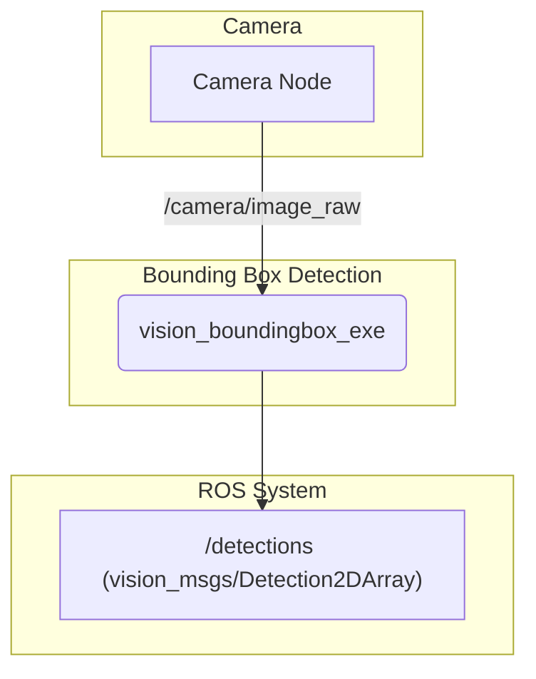

# vision_boundingbox

This package provides a ROS 2 node that performs real-time object detection using a YOLO model and publishes the resulting bounding boxes.

## How it Works

The `vision_boundingbox_exe` node is a C++ application that uses the Intel OpenVINO™ toolkit to run inference with a YOLO object detection model.

-   **Input**: An image stream from a ROS topic (e.g., `/camera/image_raw`).
-   **Processing**:
    1.  The node subscribes to the input image topic.
    2.  Each image is pre-processed and fed into the YOLO model for inference. The model files are loaded from the `share/<package_name>/models` directory.
    3.  The OpenVINO backend is used for hardware-accelerated inference.
-   **Output**: The detected objects are published as a `vision_msgs/msg/Detection2DArray` message on a topic like `/detections`. Each detection includes the object's class, a confidence score, and a 2D bounding box.

## Example Usage



## How to Use

This node is typically run from a launch file where the input image topic and model parameters can be configured.

To run the node manually:

```bash
# Remap the input image topic to your camera's output
ros2 run vision_boundingbox vision_boundingbox_exe --ros-args -r image_topic:=/camera/image_raw
```

You may need to specify which model to use and other parameters via the launch file or as ROS parameters.

## External Resources

-   [Intel OpenVINO™ Toolkit](https://www.intel.com/content/www/us/en/developer/tools/openvino-toolkit/overview.html)
-   [YOLO Object Detection](https://pjreddie.com/darknet/yolo/)
-   [vision_msgs/Detection2DArray Message](http://docs.ros.org/en/noetic/api/vision_msgs/html/msg/Detection2DArray.html)
