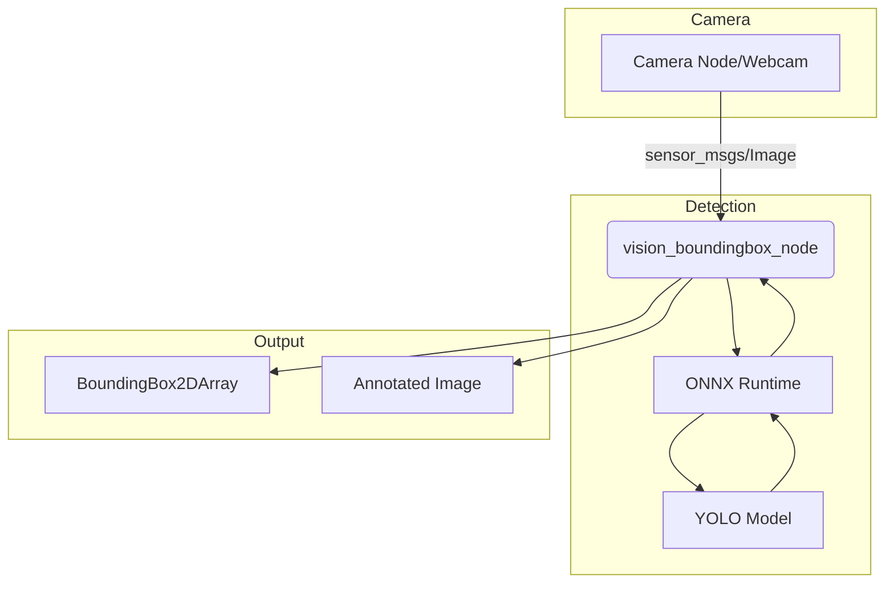
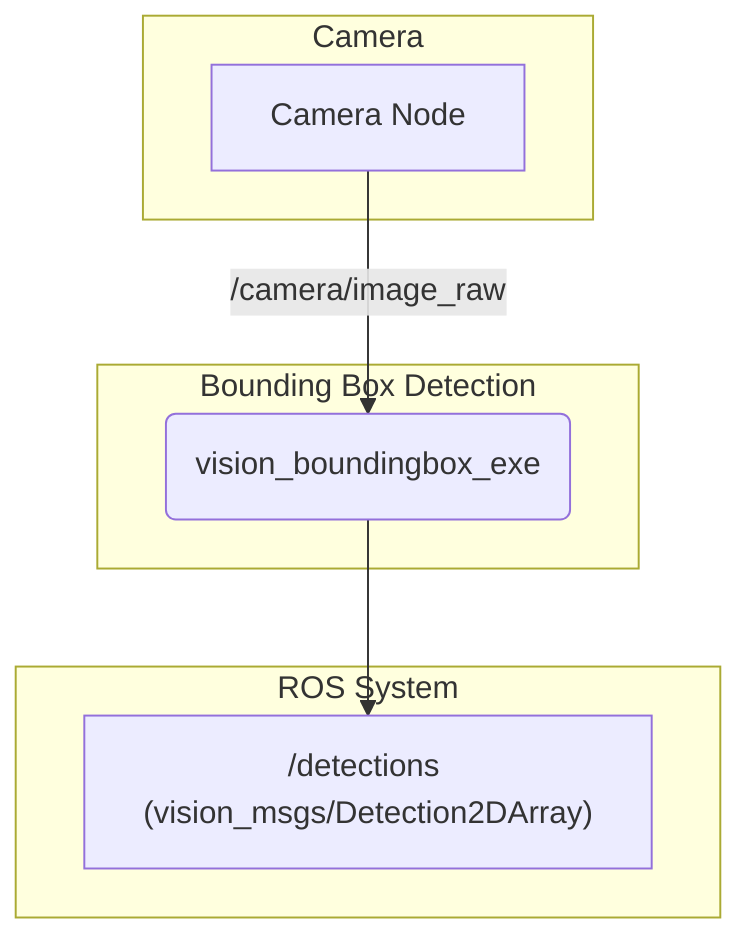

# vision_boundingbox

This package provides a ROS 2 node that performs real-time object detection using a YOLO model with ONNX Runtime and publishes the resulting bounding boxes.

## Features

- **Python 3** implementation for easy customization
- **ONNX Runtime** for cross-platform inference
- **Hardware acceleration** support (CPU/CUDA)
- **Asynchronous processing** with threaded inference
- **Flexible input sources**: ROS topics or webcam
- **Visualization** support with OpenCV
- **Start/Stop service** for runtime control

## How it Works

The `vision_boundingbox_node` is a Python application that uses ONNX Runtime to run inference with a YOLO object detection model.

-   **Input**: An image stream from a ROS topic (e.g., `/camera/image_raw`) or a webcam.
-   **Processing**:
    1.  The node subscribes to the input image topic or reads from webcam.
    2.  Images are queued and processed asynchronously in a separate thread.
    3.  Each image is preprocessed and fed into the YOLO model for inference.
    4.  ONNX Runtime is used for cross-platform inference with optional hardware acceleration.
    5.  Post-processing includes confidence filtering and Non-Maximum Suppression (NMS).
-   **Output**: The detected objects are published as a `vision_msgs/msg/BoundingBox2DArray` message on `/vision/detections/bounding_box`. Each detection includes a 2D bounding box with center position and size.

## Installation

### Prerequisites

1. Install ONNX Runtime:
```bash
pip install onnxruntime  # CPU version
# or
pip install onnxruntime-gpu  # GPU version (requires CUDA)
```

2. Install other Python dependencies:
```bash
pip install opencv-python numpy
```

### Convert YOLO Model to ONNX

You need a YOLO model in ONNX format. If you have a PyTorch YOLO model:

```bash
# Using Ultralytics YOLOv8/v11
pip install ultralytics
yolo export model=yolo11n.pt format=onnx
```

Place the exported `yolo11n.onnx` file in the `models/` directory.

## Usage

### Parameters

- `webcam` (bool, default: false): Use webcam instead of ROS topic
- `camera_index` (int, default: 0): Webcam device index
- `input_topic` (string, default: '/camera/image_raw'): Input image topic
- `device` (string, default: 'CPU'): Device for inference ('CPU' or 'CUDA')
- `input_height` (int, default: 640): Model input height
- `input_width` (int, default: 640): Model input width
- `visualize` (bool, default: false): Show detection visualization window
- `publish_image` (bool, default: false): Publish annotated image
- `model_name` (string, default: 'yolo11n.onnx'): ONNX model filename
- `conf_threshold` (float, default: 0.5): Confidence threshold
- `nms_threshold` (float, default: 0.4): NMS IoU threshold

### Running the Node

```bash
# Basic usage with ROS topic
ros2 run vision_boundingbox vision_boundingbox_node

# With webcam
ros2 run vision_boundingbox vision_boundingbox_node --ros-args \
  -p webcam:=true \
  -p visualize:=true

# With custom parameters
ros2 run vision_boundingbox vision_boundingbox_node --ros-args \
  -p input_topic:=/camera/image_raw \
  -p device:=CUDA \
  -p visualize:=true \
  -p publish_image:=true \
  -p conf_threshold:=0.6
```

### Services

- `~/start_stop` (std_srvs/SetBool): Start or stop detection at runtime

```bash
# Stop detection
ros2 service call /vision_boundingbox_node/start_stop std_srvs/srv/SetBool "{data: false}"

# Start detection
ros2 service call /vision_boundingbox_node/start_stop std_srvs/srv/SetBool "{data: true}"
```

### Topics

**Subscribed:**
- `<input_topic>` (sensor_msgs/Image): Input camera images

**Published:**
- `/vision/detections/bounding_box` (vision_msgs/BoundingBox2DArray): Detected bounding boxes
- `/vision/detections/image` (sensor_msgs/Image): Annotated images (if `publish_image:=true`)

## Performance Tips

1. **Use CUDA**: If you have an NVIDIA GPU, install `onnxruntime-gpu` and set `device:=CUDA` for significant speedup.

2. **Adjust queue size**: The node uses a queue of 3 frames by default to handle processing delays.

3. **Model size**: Use smaller models (e.g., yolo11n) for faster inference on CPU, larger models (e.g., yolo11x) for better accuracy on GPU.

4. **Input size**: Smaller input sizes (e.g., 320x320) are faster but less accurate than larger sizes (e.g., 640x640).

## Example Workflow


```mermaid
graph TD
    subgraph Camera
        A[Camera Node/Webcam]
    end

    subgraph Detection
        B(vision_boundingbox_node)
        C[ONNX Runtime]
        D[YOLO Model]
    end

    subgraph Output
        E[BoundingBox2DArray]
        F[Annotated Image]
    end

    A -- sensor_msgs/Image --> B
    B --> C
    C --> D
    D --> C
    C --> B
    B --> E
    B --> F
```

## Troubleshooting

### Model not found
Ensure your ONNX model is in the `models/` directory and the filename matches the `model_name` parameter.

### CUDA errors
If using CUDA, ensure you have `onnxruntime-gpu` installed and compatible CUDA drivers.

### Slow performance
- Try reducing input size with `-p input_height:=320 -p input_width:=320`
- Use a smaller model variant (yolo11n instead of yolo11x)
- Enable CUDA if available

## License

TODO: License declaration


## Example Usage


```mermaid
graph TD
    subgraph Camera
        A[Camera Node]
    end

    subgraph Bounding Box Detection
        B(vision_boundingbox_exe)
    end

    subgraph ROS System
        C["/detections (vision_msgs/Detection2DArray)"]
    end

    A -- "/camera/image_raw" --> B;
    B --> C;
```

## How to Use

This node is typically run from a launch file where the input image topic and model parameters can be configured.

To run the node manually:

```bash
# Remap the input image topic to your camera's output
ros2 run vision_boundingbox vision_boundingbox_exe --ros-args -r image_topic:=/camera/image_raw
```

You may need to specify which model to use and other parameters via the launch file or as ROS parameters.

## External Resources

-   [Intel OpenVINO™ Toolkit](https://www.intel.com/content/www/us/en/developer/tools/openvino-toolkit/overview.html)
-   [YOLO Object Detection](https://pjreddie.com/darknet/yolo/)
-   [vision_msgs/Detection2DArray Message](http://docs.ros.org/en/noetic/api/vision_msgs/html/msg/Detection2DArray.html)
