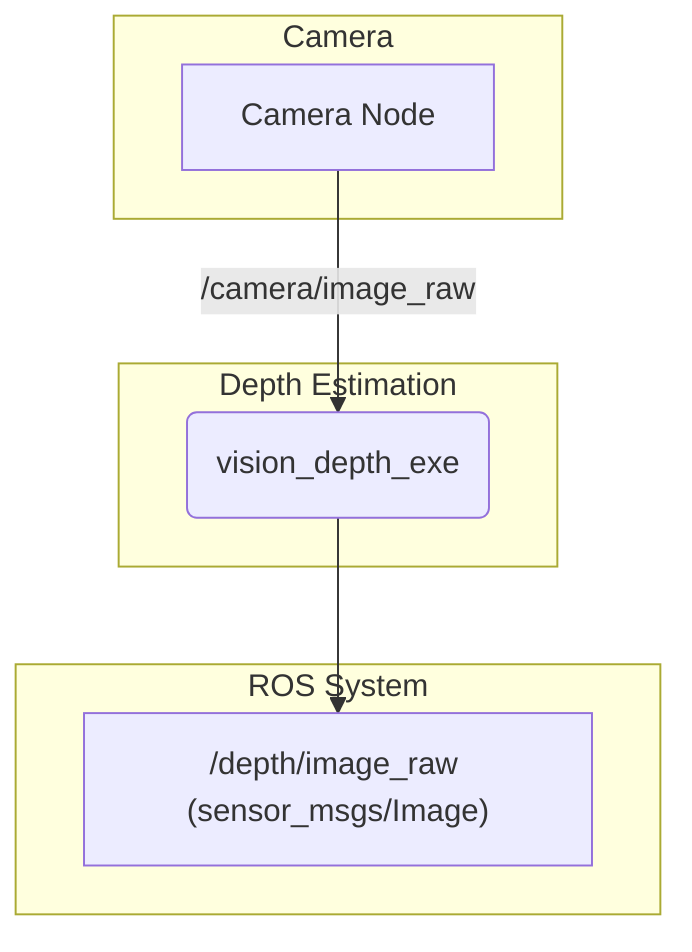

# vision_depth

This package provides a ROS 2 node that performs monocular depth estimation, creating a depth map from a single RGB camera image using a neural network.

## How it Works

The `vision_depth_exe` node uses the Intel OpenVINO™ toolkit to run a deep-learning model for depth estimation (e.g., "Depth Anything").

-   **Input**: An image stream from a ROS topic (e.g., `/camera/image_raw`).
-   **Processing**:
    1.  The node subscribes to the input image topic.
    2.  Each image is passed to the depth estimation model for inference. The model files are loaded from the `share/<package_name>/models` directory.
    3.  The OpenVINO backend provides hardware-accelerated inference.
-   **Output**: The resulting depth map is published as a `sensor_msgs/msg/Image` on a topic like `/depth/image_raw`. The image is typically encoded in a format like `32FC1`, where each pixel's value represents the estimated depth at that point.

## Example Usage



## How to Use

This node is typically run from a launch file where the input image topic and model parameters can be configured.

To run the node manually:

```bash
# Remap the input image topic to your camera's output
ros2 run vision_depth vision_depth_exe --ros-args -r image_topic:=/camera/image_raw
```

## External Resources

-   [Intel OpenVINO™ Toolkit](https://www.intel.com/content/www/us/en/developer/tools/openvino-toolkit/overview.html)
-   [Depth Anything (Paper)](https://arxiv.org/abs/2401.10891)
-   [sensor_msgs/Image Message](http://docs.ros.org/en/noetic/api/sensor_msgs/html/msg/Image.html)
