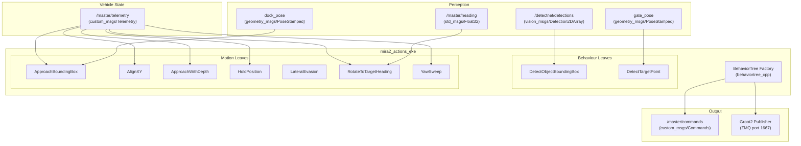
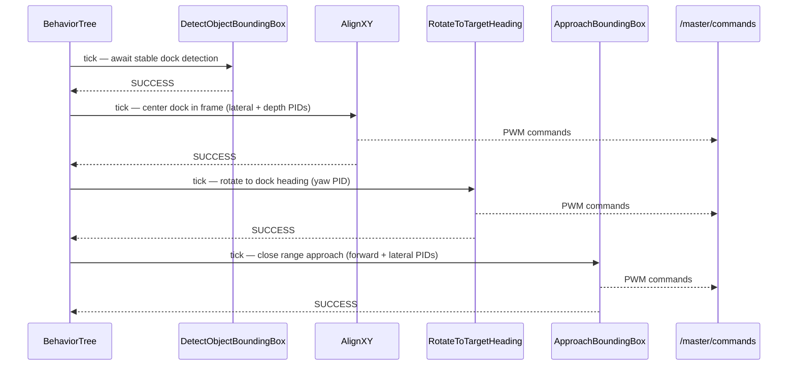

# mira2_actions

Behavior Tree-based autonomous task execution for the Mira2 AUV. Each mission (gate pass, docking, bucket task) is described as an XML behavior tree that composes reusable motion and detection leaf nodes.

## Architecture



## Behavior Tree Nodes

### Behaviour (Condition / Action) Nodes
| Node | Description |
|---|---|
| `DetectObjectBoundingBox` | Waits for a stable YOLO detection from `/detectnet/detections` with consistency checking |
| `DetectTargetPoint` | Detects a target point from a configurable pose topic with optional color filtering |

### Motion (Action) Nodes
| Node | Description |
|---|---|
| `ApproachBoundingBox` | PID-controlled forward approach to a detected bounding box |
| `AlignXY` | PD lateral/depth alignment to center a detection in frame |
| `ApproachWithDepth` | Descends to a depth setpoint while maintaining heading |
| `HoldPosition` | Holds the current position for a configurable duration |
| `TimedForward` | Drives forward at fixed thrust for a fixed duration |
| `LateralEvasion` | Moves laterally to avoid an obstacle |
| `RotateToTargetHeading` | Rotates to an absolute heading via yaw PID |
| `YawSweep` | Oscillates yaw to search for a target |

## Mission XML Files

| File | Description |
|---|---|
| `config/default.xml` | Simple single-gate approach |
| `config/docking.xml` | 4-phase docking: detect → align XY → align yaw → approach |
| `config/bucket_task.xml` | Bucket detection and approach task |
| `config/test_detect_adarsh.xml` | Detection smoke-test tree |

## Topics

| Topic | Type | Direction |
|---|---|---|
| `/master/telemetry` | `custom_msgs/Telemetry` | Subscribed |
| `/master/heading` | `std_msgs/Float32` | Subscribed |
| `detectnet/detections` | `vision_msgs/Detection2DArray` | Subscribed |
| `gate_pose` | `geometry_msgs/PoseStamped` | Subscribed |
| `dock_pose` | `geometry_msgs/PoseStamped` | Subscribed |
| `/master/commands` | `custom_msgs/Commands` | Published |
| `<name>_pid_error` | `std_msgs/Float32` | Published (debug) |
| `<name>_pid_output` | `std_msgs/Float32` | Published (debug) |

## Docking Sequence



## Usage

```bash
ros2 launch mira2_actions mira2_actions_launch.py
```

To visualize the running behavior tree, connect Groot2 to `localhost:1667`.

To change the active mission, edit `mira2_actions_launch.py` and point the `tree_xml` parameter at the desired config file.
