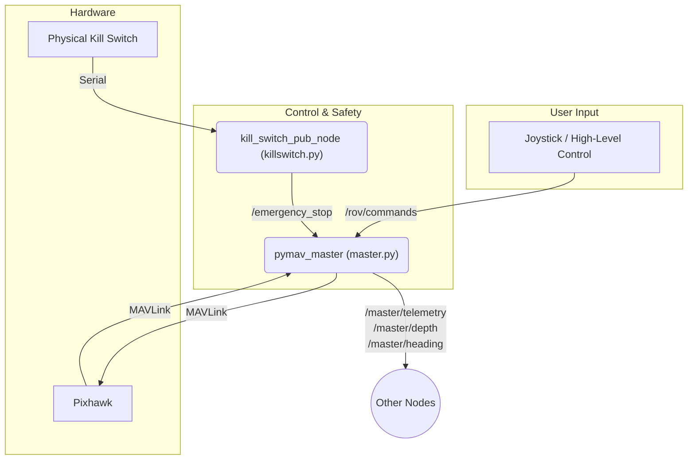

# mira2_control_master

This package is the primary interface to the Pixhawk flight controller, translating ROS 2 commands into MAVLink messages. It also provides an emergency killswitch mechanism.

## How it Works

The package contains two main nodes:

1.  `pymav_master` (`master.py`): Connects to the Pixhawk via a serial port. It handles arming, disarming, mode switching, and relays thruster commands. It also reads telemetry from the Pixhawk and publishes it to various `/master/*` topics.
2.  `kill_switch_pub_node` (`killswitch.py`): Monitors a physical kill switch connected via an Arduino. If the switch is triggered, it publishes an `EmergencyKill` message to the `/emergency_stop` topic, causing `pymav_master` to disarm and lock the system.

## Example Usage



## How to Use

To launch the main control node:

```bash
ros2 launch mira2_control_master master.launch
```

To launch the killswitch monitor:

```bash
ros2 run mira2_control_master killswitch
```

## External Resources

-   [ArduPilot Rover Documentation](https://ardupilot.org/rover/)
-   [MAVLink Protocol](https://mavlink.io/en/)

