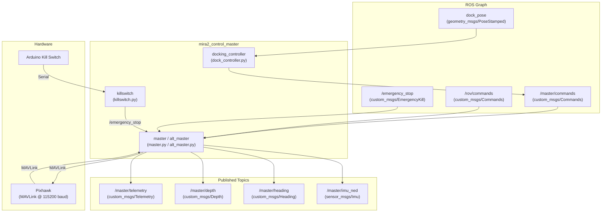
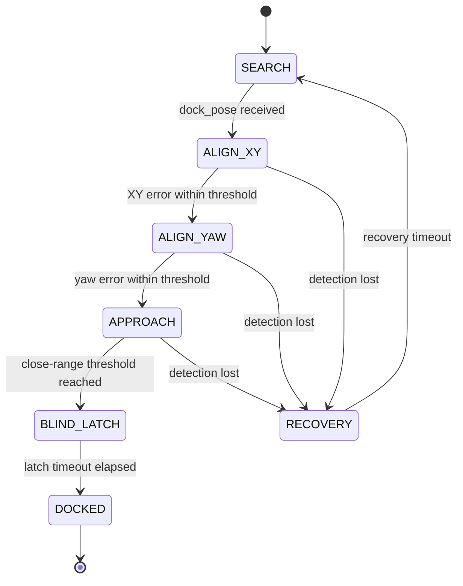

# mira2_control_master

Primary hardware interface between the ROS 2 system and the Pixhawk flight controller. Translates `custom_msgs/Commands` into MAVLink RC override messages and publishes vehicle telemetry back to the ROS graph. Also provides an emergency kill-switch monitor and a docking state machine.

## Architecture


```mermaid
graph TD
    subgraph ROS Graph
        RCMD["/master/commands<br/>(custom_msgs/Commands)"]
        VCMD["/rov/commands<br/>(custom_msgs/Commands)"]
        EKILL["/emergency_stop<br/>(custom_msgs/EmergencyKill)"]
        DPOSE["dock_pose<br/>(geometry_msgs/PoseStamped)"]
    end

    subgraph mira2_control_master
        MASTER["master / alt_master<br/>(master.py / alt_master.py)"]
        KS["killswitch<br/>(killswitch.py)"]
        DOCK["docking_controller<br/>(dock_controller.py)"]
    end

    subgraph Published Topics
        TEL["/master/telemetry<br/>(custom_msgs/Telemetry)"]
        DEP["/master/depth<br/>(custom_msgs/Depth)"]
        HDG["/master/heading<br/>(custom_msgs/Heading)"]
        IMU["/master/imu_ned<br/>(sensor_msgs/Imu)"]
    end

    subgraph Hardware
        PX["Pixhawk<br/>(MAVLink @ 115200 baud)"]
        ARD["Arduino Kill Switch"]
    end

    RCMD --> MASTER
    VCMD --> MASTER
    EKILL --> MASTER
    DPOSE --> DOCK

    ARD -- Serial --> KS
    KS -- "/emergency_stop" --> MASTER

    MASTER -- MAVLink --> PX
    PX -- MAVLink --> MASTER

    MASTER --> TEL
    MASTER --> DEP
    MASTER --> HDG
    MASTER --> IMU

    DOCK --> RCMD
```

## Nodes

### `master` / `alt_master` (`master.py` / `alt_master.py`)

Main MAVLink bridge. Connects to the Pixhawk over serial, relays arm/disarm and mode commands, sends RC channel overrides from `/master/commands`, and reads back HEARTBEAT, ATTITUDE, SCALED_PRESSURE, and RC_CHANNELS_RAW messages to build the telemetry stream.

**RC Channel Mapping**

| Channel | Axis |
|---|---|
| 1 | Pitch |
| 2 | Roll |
| 3 | Throttle (heave) |
| 4 | Yaw |
| 5 | Forward (surge) |
| 6 | Lateral (sway) |
| 7–8 | Servo outputs |

**Services:**
- `/clear_emergency` (`std_srvs/Empty`) — manually clear emergency lock
- `/toggle_emergency` (`std_srvs/Trigger`) — toggle emergency state (alt_master only)

**Parameters:**
- `initial_mode` (default: `"STABILIZE"`) — ArduSub mode at startup
- `pixhawk_address` (default: `"/dev/Pixhawk"`) — serial device path

### `killswitch` (`killswitch.py`)

Monitors a physical kill switch wired through an Arduino over serial. Publishes `EmergencyKill` to `/emergency_stop` when the switch is triggered, causing `master` to disarm and lock all commands.

### `docking_controller` (`dock_controller.py`)

State machine that drives the AUV toward a docking target using `dock_pose` (ArUco marker pose). Runs independently of the behavior tree pipeline.

**State Machine:**


```mermaid
stateDiagram-v2
    [*] --> SEARCH
    SEARCH --> ALIGN_XY : dock_pose received
    ALIGN_XY --> ALIGN_YAW : XY error within threshold
    ALIGN_YAW --> APPROACH : yaw error within threshold
    APPROACH --> BLIND_LATCH : close-range threshold reached
    BLIND_LATCH --> DOCKED : latch timeout elapsed
    ALIGN_XY --> RECOVERY : detection lost
    ALIGN_YAW --> RECOVERY : detection lost
    APPROACH --> RECOVERY : detection lost
    RECOVERY --> SEARCH : recovery timeout
    DOCKED --> [*]
```

## Topics

| Topic | Type | Direction |
|---|---|---|
| `/master/commands` | `custom_msgs/Commands` | Subscribed |
| `/rov/commands` | `custom_msgs/Commands` | Subscribed |
| `/emergency_stop` | `custom_msgs/EmergencyKill` | Subscribed |
| `/esp/telemetry` | `custom_msgs/EmergencyKill` | Subscribed |
| `dock_pose` | `geometry_msgs/PoseStamped` | Subscribed (docking_controller) |
| `/master/telemetry` | `custom_msgs/Telemetry` | Published |
| `/master/depth` | `custom_msgs/Depth` | Published |
| `/master/heading` | `custom_msgs/Heading` | Published |
| `/master/imu_ned` | `sensor_msgs/Imu` | Published |

## Usage

```bash
# Primary Pixhawk interface
ros2 launch mira2_control_master master.launch

# Alternative interface (with Groot2 logging)
ros2 launch mira2_control_master alt_master.launch

# Emergency kill-switch monitor
ros2 launch mira2_control_master killswitch.launch

# Docking controller state machine
ros2 run mira2_control_master docking_controller_node
```

## External Resources

- [ArduSub (Pixhawk for underwater vehicles)](https://www.ardusub.com/)
- [MAVLink Protocol](https://mavlink.io/en/)
- [pymavlink](https://github.com/ArduPilot/pymavlink)
