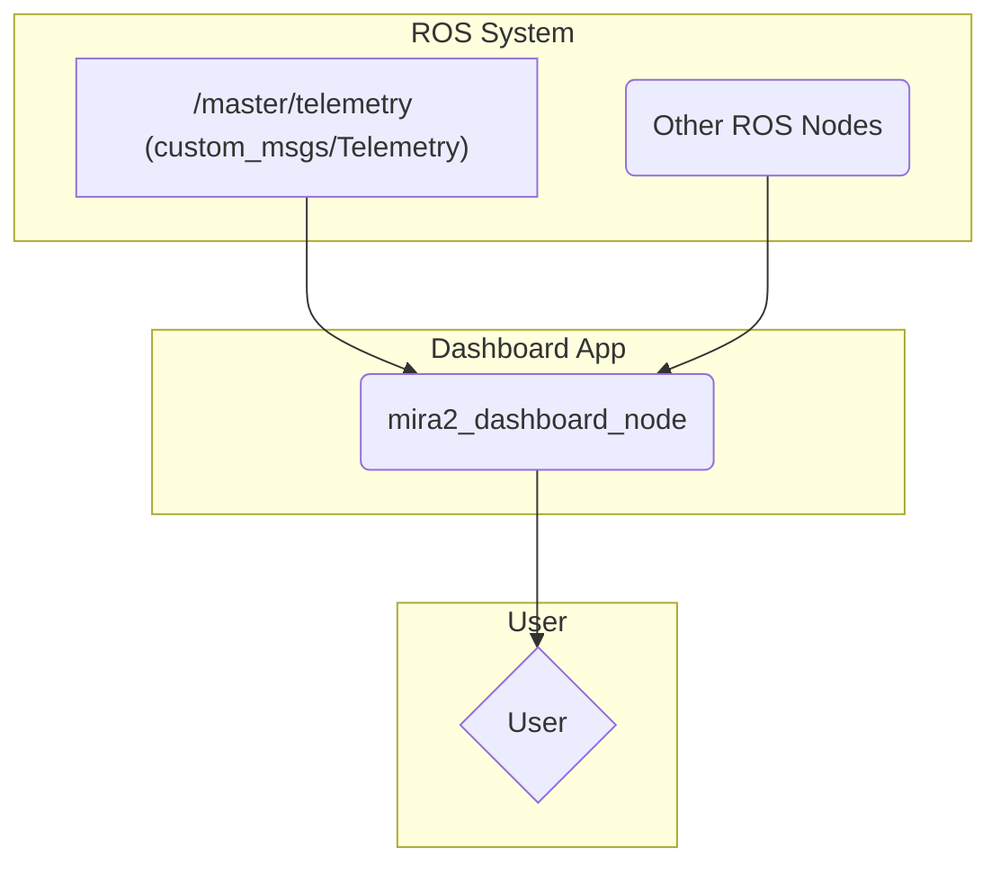

# mira2_dashboard

This package provides a desktop GUI dashboard built with PyQt6 to monitor the status and telemetry of the ROV.

## How it Works

The dashboard is a standalone PyQt6 application that uses ROS 2 to gather information.

-   **main.py**: The main application window. It checks the status of other ROS nodes (like `mira2_control_master`) and hardware connections (like the controller and a Raspberry Pi).
-   **telemetry_viz.py**: A widget that subscribes to the `/master/telemetry` topic and displays real-time plots of IMU data, orientation, and navigation information using `pyqtgraph`.
-   **pwm_viz.py**: A widget that visualizes the PWM values sent to the thrusters on a diagram of the ROV.
-   **ros_status.py**: Utility functions to check if ROS 2 nodes are alive.
-   **connection_status.py**: Utility functions to check for connected hardware like joysticks and SSH reachability of other devices.

## Example Usage



## How to Use

To launch the dashboard:

```bash
ros2 launch mira2_dashboard mira2_dashboard_launch.py
```

Note: The launch file seems to be configured for a C++ node (`mira2_dashboard_exe`), but the package is Python-based. You might need to run the main script directly if the launch file is incorrect:

```bash
python3 src/mira2_dashboard/mira2_dashboard/main.py
```

## External Resources

-   [PyQt6 Documentation](https://www.riverbankcomputing.com/static/Docs/PyQt6/)
-   [pyqtgraph Documentation](https://www.pyqtgraph.org/)
