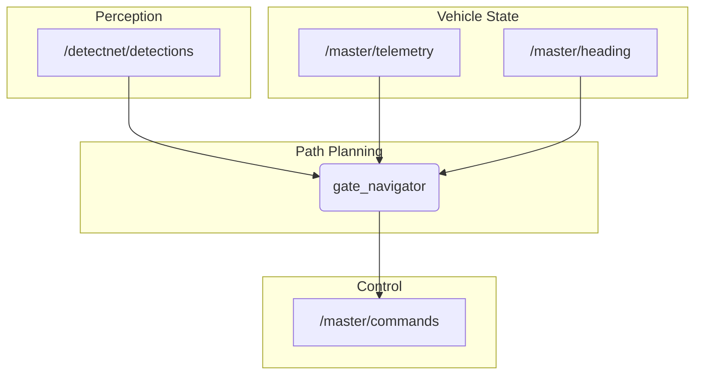

# mira2_path_planning

This package contains nodes for autonomous path planning. The current implementation focuses on a hardcoded sequence for navigating through a gate.

## How it Works

The `gate_navigator` node executes a timed sequence of actions to approach and pass through a gate. It uses several PID controllers to maintain stability and navigate.

-   **State Machine**: The node follows a simple time-based state machine:
    1.  (0-5s): Initialize and determine the current yaw as the setpoint.
    2.  (5-10s): Sink to a target depth while maintaining heading.
    3.  (10-20s): Move forward to pass through the gate.
-   **PID Control**:
    -   A **depth PID** uses `/master/telemetry` (external pressure) to maintain a constant depth.
    -   A **yaw PID** uses `/master/heading` to maintain a constant heading.
    -   A **lateral PID** uses `/detectnet/detections` to center the ROV on the detected gate.
-   **Output**: The node publishes PWM commands to the `/master/commands` topic to control the thrusters.

## Example Usage



## How to Use

To launch the gate navigation sequence:

```bash
ros2 launch mira2_path_planning qauli.launch
```

**Note**: This is a hardcoded routine and not a general-purpose path planner. The timings and PID values are specific to a particular task.

## External Resources

-   [PID Controller Theory](https://en.wikipedia.org/wiki/PID_controller)
