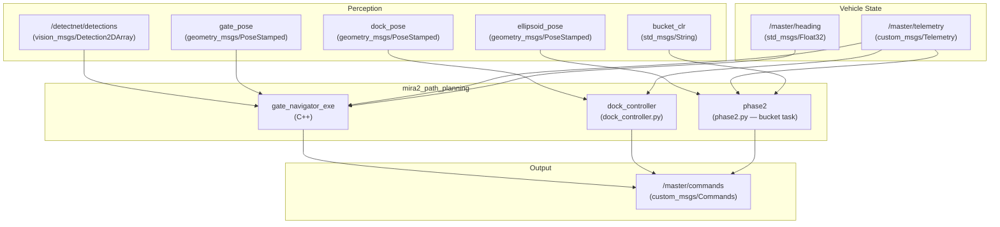
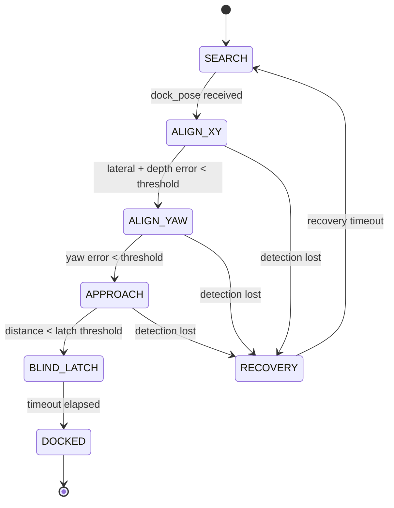

# mira2_path_planning

Autonomous navigation nodes for the Mira2 AUV. Provides task-specific navigation for gate traversal, docking, and bucket approach. Each node implements a closed-loop PID controller driven by perception data and vehicle telemetry.

## Architecture


```mermaid
graph TD
    subgraph Perception
        DET["/detectnet/detections<br/>(vision_msgs/Detection2DArray)"]
        GP["gate_pose<br/>(geometry_msgs/PoseStamped)"]
        DP["dock_pose<br/>(geometry_msgs/PoseStamped)"]
        EP["ellipsoid_pose<br/>(geometry_msgs/PoseStamped)"]
        BKT["bucket_clr<br/>(std_msgs/String)"]
    end

    subgraph Vehicle State
        TEL["/master/telemetry<br/>(custom_msgs/Telemetry)"]
        HDG["/master/heading<br/>(std_msgs/Float32)"]
    end

    subgraph mira2_path_planning
        GN["gate_navigator_exe<br/>(C++)"]
        DC["dock_controller<br/>(dock_controller.py)"]
        P2["phase2<br/>(phase2.py — bucket task)"]
    end

    subgraph Output
        CMD["/master/commands<br/>(custom_msgs/Commands)"]
    end

    DET --> GN
    GP  --> GN
    TEL --> GN
    HDG --> GN

    DP  --> DC
    TEL --> DC

    EP  --> P2
    TEL --> P2
    BKT --> P2

    GN --> CMD
    DC --> CMD
    P2 --> CMD
```

## Nodes

### `gate_navigator_exe` (C++)

Vision-guided gate approach node running at 10 Hz. Uses four PID controllers to simultaneously maintain depth, heading, lateral centering on the detected gate, and forward progress.

**PID configuration (defaults):**

| Controller | kp | ki | kd | base_offset | setpoint |
|---|---|---|---|---|---|
| Depth | 5.5 | 0.03 | 31.5 | 1580 | 1069 |
| Yaw | 3.18 | 0.01 | 7.2 | 1500 | 280° |
| Lateral | −0.5 | −0.05 | −2.0 | 1500 | center |
| Forward | −0.8 | −0.1 | −4.0 | 1500 | — |

### `dock_controller` (`dock_controller.py`)

State machine docking controller running at 20 Hz. Drives the AUV to an ArUco-tagged dock through a sequence of alignment and approach phases.

**Docking state machine:**


```mermaid
stateDiagram-v2
    [*] --> SEARCH
    SEARCH --> ALIGN_XY : dock_pose received
    ALIGN_XY --> ALIGN_YAW : lateral + depth error < threshold
    ALIGN_YAW --> APPROACH : yaw error < threshold
    APPROACH --> BLIND_LATCH : distance < latch threshold
    BLIND_LATCH --> DOCKED : timeout elapsed
    ALIGN_XY --> RECOVERY : detection lost
    ALIGN_YAW --> RECOVERY : detection lost
    APPROACH --> RECOVERY : detection lost
    RECOVERY --> SEARCH : recovery timeout
    DOCKED --> [*]
```

### `phase2` (`phase2.py`) — Bucket Task

Vision-based bucket approach for Phase 2 of the competition task. Aligns with a colored ellipsoid marker, then approaches and locks onto the bucket.

**States:** `SEARCH → ALIGN_XY → APPROACH → LOCK → SEARCH2`

## Topics

| Topic | Type | Direction | Node |
|---|---|---|---|
| `/master/telemetry` | `custom_msgs/Telemetry` | Subscribed | all |
| `/master/heading` | `std_msgs/Float32` | Subscribed | gate_navigator |
| `detectnet/detections` | `vision_msgs/Detection2DArray` | Subscribed | gate_navigator |
| `gate_pose` | `geometry_msgs/PoseStamped` | Subscribed | gate_navigator |
| `dock_pose` | `geometry_msgs/PoseStamped` | Subscribed | dock_controller |
| `ellipsoid_pose` | `geometry_msgs/PoseStamped` | Subscribed | phase2 |
| `bucket_clr` | `std_msgs/String` | Subscribed | phase2 |
| `/master/commands` | `custom_msgs/Commands` | Published | all |
| `<name>_pid_error/output` | `std_msgs/Float32` | Published | all (debug) |

## Usage

```bash
# Gate navigation
ros2 launch mira2_path_planning qauli.launch

# Docking controller
ros2 run mira2_path_planning dock_controller

# Bucket phase 2
ros2 run mira2_path_planning phase2
```

> These are task-specific routines. PID gains and timing parameters are tuned for competition hardware and will need adjustment for different vehicles.

## External Resources

- [PID Controller Theory](https://en.wikipedia.org/wiki/PID_controller)
- [ArUco Marker Detection](https://docs.opencv.org/4.x/d5/dae/tutorial_aruco_detection.html)
