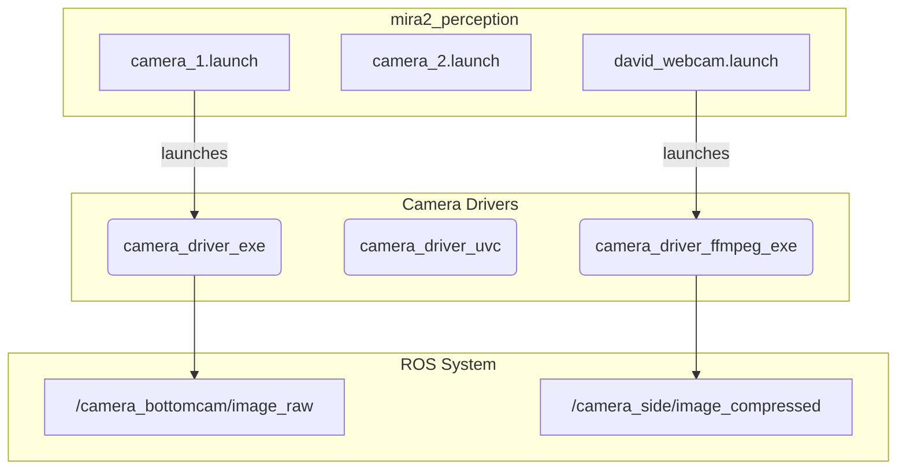

# mira2_perception

This package contains launch files to start camera nodes for the ROV's perception system. It acts as a centralized place to manage different camera configurations.

## How it Works

This is a meta-package that does not contain any source code. Instead, it provides a set of launch files that start camera driver nodes from other packages (e.g., `camera_driver`, `camera_driver_uvc`, `camera_driver_ffmpeg`) with specific parameters.

Each launch file is configured for a specific camera, identified by parameters like `vendor_id`, `product_id`, or `device_path` (`/dev/video0`).

## Example Usage



## How to Use

Launch the desired camera using its corresponding launch file.

For the bottom-facing camera:

```bash
ros2 launch mira2_perception camera_1.launch
```

For the side-facing camera:

```bash
ros2 launch mira2_perception david_webcam.launch
```

You can modify the arguments within each launch file (e.g., `image_width`, `framerate`) to change the camera's behavior.

## External Resources

-   [ROS 2 Launch Files](https://docs.ros.org/en/humble/Tutorials/Intermediate/Launch/Creating-Launch-Files.html)
