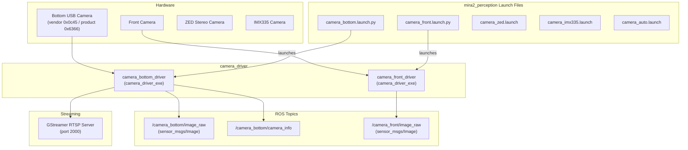
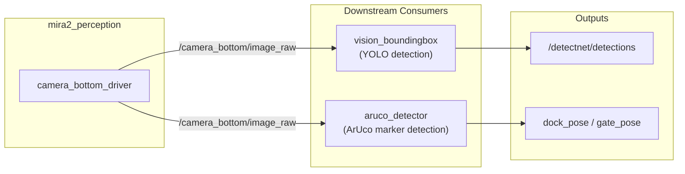

# mira2_perception

Camera management package for the Mira2 AUV. Provides launch files that configure and start camera driver nodes for each physical camera, with optional GStreamer RTSP streaming for remote monitoring.

## Architecture


```mermaid
graph TD
    subgraph Hardware
        CAM_B["Bottom USB Camera<br/>(vendor 0x0c45 / product 0x6366)"]
        CAM_F["Front Camera"]
        CAM_Z["ZED Stereo Camera"]
        CAM_I["IMX335 Camera"]
    end

    subgraph mira2_perception Launch Files
        LB["camera_bottom.launch.py"]
        LF["camera_front.launch.py"]
        LZ["camera_zed.launch"]
        LI["camera_imx335.launch"]
        LA["camera_auto.launch"]
    end

    subgraph camera_driver
        DRV_B["camera_bottom_driver<br/>(camera_driver_exe)"]
        DRV_F["camera_front_driver<br/>(camera_driver_exe)"]
    end

    subgraph ROS Topics
        IMG_B["/camera_bottom/image_raw<br/>(sensor_msgs/Image)"]
        INFO_B["/camera_bottom/camera_info"]
        IMG_F["/camera_front/image_raw<br/>(sensor_msgs/Image)"]
    end

    subgraph Streaming
        RTSP["GStreamer RTSP Server<br/>(port 2000)"]
    end

    CAM_B --> DRV_B
    CAM_F --> DRV_F
    LB -- launches --> DRV_B
    LF -- launches --> DRV_F

    DRV_B --> IMG_B
    DRV_B --> INFO_B
    DRV_B --> RTSP
    DRV_F --> IMG_F
```

## Launch Files

| File | Camera | Resolution | Format | RTSP Port |
|---|---|---|---|---|
| `camera_bottom.launch.py` | USB bottom camera (0x0c45:0x6366) | 1280×720 | MJPEG @ 30 fps | 2000 |
| `camera_front.launch.py` | USB front camera | configured per-device | — | — |
| `camera_zed.launch` | ZED stereo camera | — | — | — |
| `camera_imx335.launch` | IMX335 camera | — | — | — |
| `camera_auto.launch` | Automatic detection | — | — | — |

## Camera Driver Parameters (`camera_bottom`)

| Parameter | Value |
|---|---|
| `vendor_id` | `0x0c45` |
| `product_id` | `0x6366` |
| `serial_no` | `SN0001` |
| `image_width` | `1280` |
| `image_height` | `720` |
| `frame_format` | `MJPEG` |
| `framerate` | `30` |
| `rtsp_port` | `2000` |
| `camera_frame_id` | `camera_bottom` |
| `camera_info_url` | `package:///mira2_perception/config/camera_bottom.ini` |

## Data Flow — Vision Pipeline


```mermaid
graph LR
    subgraph mira2_perception
        CAM["camera_bottom_driver"]
    end

    subgraph Downstream Consumers
        BB["vision_boundingbox<br/>(YOLO detection)"]
        AR["aruco_detector<br/>(ArUco marker detection)"]
    end

    subgraph Outputs
        DET["/detectnet/detections"]
        POSE["dock_pose / gate_pose"]
    end

    CAM -- "/camera_bottom/image_raw" --> BB
    CAM -- "/camera_bottom/image_raw" --> AR
    BB --> DET
    AR --> POSE
```

## USB Port Identifiers

The `usb_port` parameter selects which physical USB port to bind to (prevents hot-plug ambiguity):

| Platform | Value |
|---|---|
| NVIDIA Orin | `usb-xhci-hcd.1-2` |
| Raspberry Pi 4 | `usb-3610000.usb-2.4` |

## Usage

```bash
# Bottom-facing camera
ros2 launch mira2_perception camera_bottom.launch.py

# Front-facing camera
ros2 launch mira2_perception camera_front.launch.py

# ZED stereo camera
ros2 launch mira2_perception camera_zed.launch
```

View the RTSP stream from the bottom camera:
```bash
ffplay rtsp://<robot-ip>:2000/stream
```

## External Resources

- [GStreamer RTSP Server](https://gstreamer.freedesktop.org/documentation/additional/rtspsrc.html)
- [ROS 2 Launch Files](https://docs.ros.org/en/humble/Tutorials/Intermediate/Launch/Creating-Launch-Files.html)
