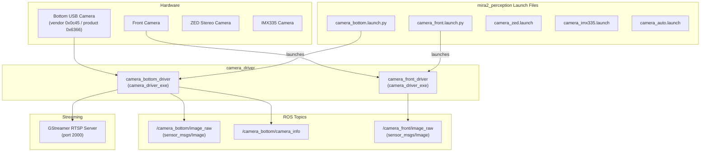
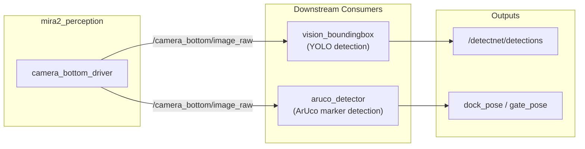

# mira2_perception

Camera management package for the Mira2 AUV. Provides launch files that configure and start camera driver nodes for each physical camera, with optional GStreamer RTSP streaming for remote monitoring.

## Architecture


```mermaid
graph TD
    subgraph Hardware
        CAM_B["Bottom USB Camera<br/>(vendor 0x0c45 / product 0x6366)"]
        CAM_F["Front Camera"]
        CAM_Z["ZED Stereo Camera"]
        CAM_I["IMX335 Camera"]
    end

    subgraph mira2_perception Launch Files
        LB["camera_bottom.launch.py"]
        LF["camera_front.launch.py"]
        LZ["camera_zed.launch"]
        LI["camera_imx335.launch"]
        LA["camera_auto.launch"]
    end

    subgraph camera_driver
        DRV_B["camera_bottom_driver<br/>(camera_driver_exe)"]
        DRV_F["camera_front_driver<br/>(camera_driver_exe)"]
    end

    subgraph ROS Topics
        IMG_B["/camera_bottom/image_raw<br/>(sensor_msgs/Image)"]
        INFO_B["/camera_bottom/camera_info"]
        IMG_F["/camera_front/image_raw<br/>(sensor_msgs/Image)"]
    end

    subgraph Streaming
        RTSP["GStreamer RTSP Server<br/>(port 2000)"]
    end

    CAM_B --> DRV_B
    CAM_F --> DRV_F
    LB -- launches --> DRV_B
    LF -- launches --> DRV_F

    DRV_B --> IMG_B
    DRV_B --> INFO_B
    DRV_B --> RTSP
    DRV_F --> IMG_F
```

## Launch Files

| File | Camera | Resolution | Format | RTSP Port |
|---|---|---|---|---|
| `camera_bottom.launch.py` | USB bottom camera (0x0c45:0x6366) | 1280×720 | MJPEG @ 30 fps | 2000 |
| `camera_front.launch.py` | USB front camera | configured per-device | — | — |
| `camera_zed.launch` | ZED stereo camera | — | — | — |
| `camera_imx335.launch` | IMX335 camera | — | — | — |
| `camera_auto.launch` | Automatic detection | — | — | — |

## Camera Driver Parameters (`camera_bottom`)

| Parameter | Value |
|---|---|
| `vendor_id` | `0x0c45` |
| `product_id` | `0x6366` |
| `serial_no` | `SN0001` |
| `image_width` | `1280` |
| `image_height` | `720` |
| `frame_format` | `MJPEG` |
| `framerate` | `30` |
| `rtsp_port` | `2000` |
| `camera_frame_id` | `camera_bottom` |
| `camera_info_url` | `package:///mira2_perception/config/camera_bottom.ini` |

## Data Flow — Vision Pipeline


```mermaid
graph LR
    subgraph mira2_perception
        CAM["camera_bottom_driver"]
    end

    subgraph Downstream Consumers
        BB["vision_boundingbox<br/>(YOLO detection)"]
        AR["aruco_detector<br/>(ArUco marker detection)"]
    end

    subgraph Outputs
        DET["/detectnet/detections"]
        POSE["dock_pose / gate_pose"]
    end

    CAM -- "/camera_bottom/image_raw" --> BB
    CAM -- "/camera_bottom/image_raw" --> AR
    BB --> DET
    AR --> POSE
```

## USB Port Identifiers

The `usb_port` parameter selects which physical USB port to bind to (prevents hot-plug ambiguity):

| Platform | Value |
|---|---|
| NVIDIA Orin | `usb-xhci-hcd.1-2` |
| Raspberry Pi 4 | `usb-3610000.usb-2.4` |

## Usage

```bash
# Bottom-facing camera
ros2 launch mira2_perception camera_bottom.launch.py

# Front-facing camera
ros2 launch mira2_perception camera_front.launch.py

# ZED stereo camera
ros2 launch mira2_perception camera_zed.launch
```

View the RTSP stream from the bottom camera:
```bash
ffplay rtsp://<robot-ip>:2000/stream
```

---

## Valve & Dock Perception — ZED + YOLOv8

Standalone perception scripts for detecting the **valve** and **docking station** using the ZED stereo camera. These scripts run outside ROS2's node graph (no topics published) and open an OpenCV display window.

### Required Folder Structure

Before running, ensure the following files are in place relative to the workspace root:

```
mira/
├── src/mira2_perception/
│   ├── datasets/
│   │   └── Main.svo2                          # ZED SVO2 recording (place here)
│   └── models/
│       └── valve_v1/
│           └── weights/
│               ├── best.pt                    # YOLOv8 trained weights
│               └── best.onnx                  # ONNX export (used by default)
```

> `Main.svo2` is not committed to the repo due to its size. Copy it manually before running.

### Setup — Source the Workspace

```bash
# TODO: replace with actual workspace source command
source /path/to/mira/install/setup.bash
```

### Run 2D Bounding Box (+ XYZ depth)

Draws a 2D green bounding box over detected valves and overlays centre-pixel depth and 3D cuboid XYZ coordinates.

```bash
ros2 run mira2_perception zed_yolo_xyz.py -- --svo src/mira2_perception/datasets/Main.svo2
```

### Run 3D Wireframe Bounding Box

Replaces the 2D rectangle with a projected 3D wireframe AABB fitted from the ZED point cloud.

```bash
ros2 run mira2_perception zed_3d_bbox.py -- --svo src/mira2_perception/datasets/Main.svo2
```

### Optional Arguments

| Argument | Default | Description |
|---|---|---|
| `--svo` | *(required)* | Path to ZED `.svo2` recording |
| `--model` | `best.onnx` (auto-resolved) | Path to `.pt` or `.onnx` model |
| `--conf` | `0.4` | YOLO confidence threshold |
| `--target` | `valve` | Class to detect (`valve`, `dock`, or `all`) |
| `--start` | `2800` | SVO start frame (frame 2800 = first valve frame) |

**Controls:** `SPACE` = pause, `→` = +200 frames, `←` = -200 frames, `Q`/`ESC` = quit

### How the YOLOv8 Model Was Trained

**Dataset:** Custom annotated dataset of underwater valve and docking station images, split across labelled parts:

```
tac_valve_dock_dataset/docking_partwise/
├── part1 annotations/converted/images/default/   # train
├── part2 annotations/converted/images/default/   # train
├── part3 annotations/converted/images/default/   # train
├── part5 annotations/converted/images/default/   # train
├── part6 annotations/converted/images/default/   # train
├── part7 annotations/converted/images/default/   # val
├── valve_1_7/images/train/                        # train
└── valve_8/images/train/                          # val
```

**Classes:** `0: dock`, `1: valve`

**Training command:**
```bash
cd /home/sanjay/DNT/mira
.venv/bin/yolo detect train \
    data=src/mira2_perception/datasets/data.yaml \
    model=yolov8n.pt \
    epochs=100 \
    imgsz=640 \
    batch=16 \
    device=0
```

**Export to ONNX** (for faster inference on Orin):
```bash
.venv/bin/python -c "
from ultralytics import YOLO
model = YOLO('src/mira2_perception/models/valve_v1/weights/best.pt')
model.export(format='onnx', imgsz=640)
"
```

Training results (confusion matrix, P/R curves, batch previews) are saved under `models/valve_v1/`.

---

## External Resources

- [GStreamer RTSP Server](https://gstreamer.freedesktop.org/documentation/additional/rtspsrc.html)
- [ROS 2 Launch Files](https://docs.ros.org/en/humble/Tutorials/Intermediate/Launch/Creating-Launch-Files.html)
