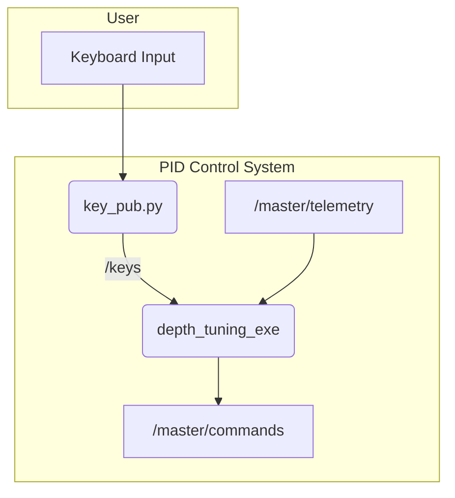

# mira2_pid_control

This package provides a collection of nodes for PID (Proportional-Integral-Derivative) control, primarily used for tuning controller gains and executing simple, hardcoded maneuvers.

## How it Works

The package contains several distinct nodes, each serving a specific purpose. The common theme is reading state information from `/master/telemetry` or `/master/heading`, calculating a control output via a PID algorithm, and publishing PWM commands to `/master/commands`.

-   **Tuner Nodes (`depth_tuner`, `yaw_tuner`)**: These nodes allow for real-time tuning of PID gains. They listen for keyboard presses on the `/keys` topic to increment or decrement P, I, and D values. This is useful for finding the optimal controller response.
-   **Action Nodes (`go_down`)**: These are simple, open-loop or minimally-closed-loop scripts that perform a single action, like moving to a certain depth.
-   **Keyboard Publisher (`key_pub.py`)**: A helper script that captures keyboard input from the terminal and publishes it to the `/keys` topic for the tuner nodes to consume.

## Example Usage (PID Tuner)



## How to Use

### PID Tuning

To tune the depth controller, run the following launch file. You can then use the keys specified in `depth_tuner.cpp` (e.g., w, s, e, d, r, f) to adjust the PID gains in real-time.

```bash
ros2 launch mira2_pid_control depth_tuning.launch
```

Similarly, to tune the yaw controller:

```bash
ros2 launch mira2_pid_control yawtuner.launch
```

### Simple Actions

To run the simple "go down" action:

```bash
ros2 run mira2_pid_control go_down_exe
# In another terminal, publish 'p' to the /keys topic to arm it
ros2 topic pub /keys std_msgs/msg/Char "{data: 'p'}"
```

## External Resources

-   [PID Controller on Wikipedia](https://en.wikipedia.org/wiki/PID_controller)
-   [ROS 2 Parameters for Dynamic Reconfiguration](https://docs.ros.org/en/humble/Tutorials/Intermediate/Ros2-Parameters-Tutorial.html) (A more advanced way to handle tuning)
