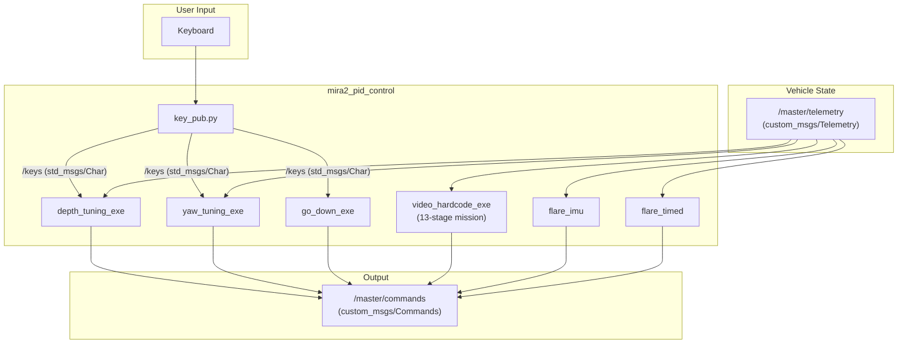
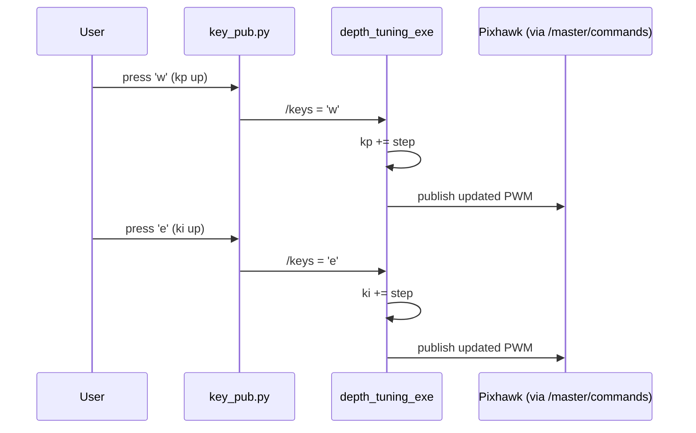

# mira2_pid_control

Collection of PID controller nodes used for interactive gain tuning, simple depth/yaw maneuvers, and hardcoded multi-stage mission sequences. All nodes read vehicle state from `/master/telemetry` and publish PWM commands to `/master/commands`.

## Architecture


```mermaid
graph TD
    subgraph User Input
        KB["Keyboard"]
    end

    subgraph mira2_pid_control
        KP["key_pub.py"]
        DT["depth_tuning_exe"]
        YT["yaw_tuning_exe"]
        GD["go_down_exe"]
        VH["video_hardcode_exe<br/>(13-stage mission)"]
        FI["flare_imu"]
        FT["flare_timed"]
    end

    subgraph Vehicle State
        TEL["/master/telemetry<br/>(custom_msgs/Telemetry)"]
    end

    subgraph Output
        CMD["/master/commands<br/>(custom_msgs/Commands)"]
    end

    KB --> KP
    KP -- "/keys (std_msgs/Char)" --> DT
    KP -- "/keys (std_msgs/Char)" --> YT
    KP -- "/keys (std_msgs/Char)" --> GD

    TEL --> DT
    TEL --> YT
    TEL --> VH
    TEL --> FI
    TEL --> FT

    DT --> CMD
    YT --> CMD
    GD --> CMD
    VH --> CMD
    FI --> CMD
    FT --> CMD
```

## Nodes

### `depth_tuning_exe`

Interactive depth PID tuner. Keyboard bindings adjust gains live at 10 Hz.

| Key | Action |
|---|---|
| `w` / `s` | kp ± |
| `e` / `d` | ki ± |
| `r` / `f` | kd ± |

### `yaw_tuning_exe`

Same interactive pattern as `depth_tuning_exe`, but for the yaw PID controller.

### `go_down_exe`

Minimal arm-and-descend action node. Press `p` to arm and apply descent thrust (1400 PWM) for 2 seconds, then disarm. Useful for basic vehicle validation.

### `video_hardcode_exe`

13-stage hardcoded mission sequence driven by `config/video_submission.yaml`. Runs each stage for a configured duration with PID-controlled depth (setpoint 1075, kp −2.0, ki −0.2, kd −10.69).

**Stages:** `initial_wait → sinking → stabilize_surge → buoyancy_delay → stabilize_yaw → ...`

### `flare_imu` / `flare_timed`

Flare avoidance maneuvers. `flare_imu` uses IMU feedback via `control_utils`; `flare_timed` runs for a fixed duration. Parameters loaded from `config/gate_flare_imu_params.yaml` and `config/gate_flare_timed_params.yaml`.

### `key_pub.py`

Helper script that reads single-character terminal input and publishes it to `/keys`. Required by all tuner nodes.

## PID Tuning Flow


```mermaid
sequenceDiagram
    participant User
    participant key_pub as key_pub.py
    participant tuner as depth_tuning_exe
    participant px as Pixhawk (via /master/commands)

    User->>key_pub: press 'w' (kp up)
    key_pub->>tuner: /keys = 'w'
    tuner->>tuner: kp += step
    tuner->>px: publish updated PWM

    User->>key_pub: press 'e' (ki up)
    key_pub->>tuner: /keys = 'e'
    tuner->>tuner: ki += step
    tuner->>px: publish updated PWM
```

## Topics

| Topic | Type | Direction |
|---|---|---|
| `/keys` | `std_msgs/Char` | Subscribed (tuner/go_down nodes) |
| `/master/telemetry` | `custom_msgs/Telemetry` | Subscribed |
| `/master/commands` | `custom_msgs/Commands` | Published |
| `<name>_pid_error` | `std_msgs/Float32` | Published (debug) |
| `<name>_pid_output` | `std_msgs/Float32` | Published (debug) |

## Usage

```bash
# Depth PID tuning
ros2 launch mira2_pid_control depth_tuning.launch

# Yaw PID tuning
ros2 launch mira2_pid_control yawtuner.launch

# Hardcoded 13-stage video submission mission
ros2 launch mira2_pid_control video.launch.py

# Flare avoidance (IMU-based)
ros2 launch mira2_pid_control hardcode_flare.launch.py

# Manual arm + descend test (press 'p' to trigger)
ros2 run mira2_pid_control go_down_exe
```

## External Resources

- [PID Controller Theory](https://en.wikipedia.org/wiki/PID_controller)
- [control_utils PID library](../dependencies/control_utils/)
