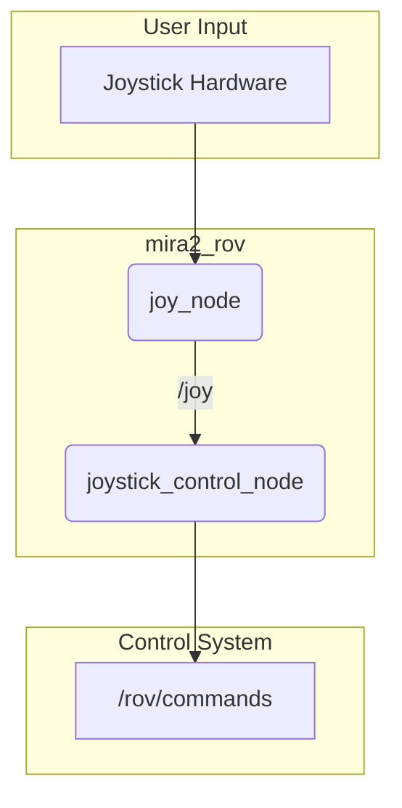

# mira2_rov

This package provides the primary teleoperation control for the Mira2 ROV, translating joystick inputs into control commands.

## How it Works

This package contains the `joystick_exe` node, which is responsible for converting raw joystick data into `custom_msgs/Commands` messages that the `mira2_control_master` package can understand.

The provided `teleop.launch` file starts two nodes:
1.  `joy_node`: The standard ROS 2 node for interfacing with a joystick or gamepad hardware. It publishes raw joystick data to the `/joy` topic.
2.  `joystick_control_node` (`joystick_exe`): This node subscribes to the `/joy` topic, interprets the joystick axes and buttons, and publishes normalized PWM commands to the `/rov/commands` topic.

## Example Usage



## How to Use

To start teleoperation control for the ROV, ensure a joystick is connected and then run the launch file:

```bash
ros2 launch mira2_rov teleop.launch
```

## External Resources

-   [joy (ROS 2 Package)](http://wiki.ros.org/joy)
