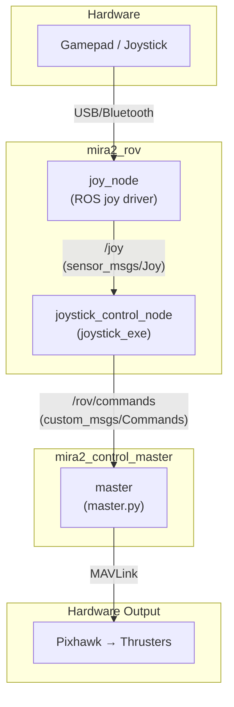
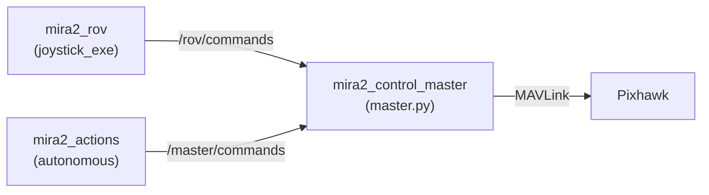

# mira2_rov

Joystick teleoperation for the Mira2 AUV. Translates raw gamepad input into `custom_msgs/Commands` PWM messages that `mira2_control_master` sends to the Pixhawk.

## Architecture


```mermaid
graph TD
    subgraph Hardware
        JS["Gamepad / Joystick"]
    end

    subgraph mira2_rov
        JOY["joy_node<br/>(ROS joy driver)"]
        JC["joystick_control_node<br/>(joystick_exe)"]
    end

    subgraph mira2_control_master
        MASTER["master<br/>(master.py)"]
    end

    subgraph Hardware Output
        PX["Pixhawk → Thrusters"]
    end

    JS -- USB/Bluetooth --> JOY
    JOY -- "/joy<br/>(sensor_msgs/Joy)" --> JC
    JC -- "/rov/commands<br/>(custom_msgs/Commands)" --> MASTER
    MASTER -- MAVLink --> PX
```

## Joystick Mapping

| Input | Action | PWM Range |
|---|---|---|
| Button 0 | Arm / Disarm toggle | — |
| Button 1 | Mode: MANUAL | — |
| Button 2 | Mode: ALT_HOLD (depth hold) | — |
| Button 3 | Mode: STABILIZE | — |
| Button 4 | Roll left | 1400 |
| Button 5 | Roll right | 1600 |
| Axis 0 | Lateral (sway) | 1500 ± 400 |
| Axis 1 | Forward (surge) | 1500 ± 400 |
| Axis 2 | Thrust modifier | — |
| Axis 3 | Yaw | 1500 ± 400 |
| Axis 4 | Pitch | — |
| Axis 5 | Combined thrust | — |

All axes use a neutral PWM of 1500 with ±400 range. Axis sensitivities: general = 0.6, yaw = 0.5, pitch = 0.5.

## Topics

| Topic | Type | Direction |
|---|---|---|
| `/joy` | `sensor_msgs/Joy` | Subscribed |
| `/rov/commands` | `custom_msgs/Commands` | Published |

## Usage

Connect a joystick and launch:

```bash
ros2 launch mira2_rov teleop.launch
```

This starts both `joy_node` (raw gamepad driver) and `joystick_control_node` (axis/button mapping).

## Integration with Full System


```mermaid
graph LR
    ROV["mira2_rov<br/>(joystick_exe)"] -- "/rov/commands" --> MASTER["mira2_control_master<br/>(master.py)"]
    ACTIONS["mira2_actions<br/>(autonomous)"] -- "/master/commands" --> MASTER
    MASTER -- MAVLink --> PX["Pixhawk"]
```

Both teleoperation (`/rov/commands`) and autonomous control (`/master/commands`) feed into `mira2_control_master`. Only one source should be active at a time; the last received command wins.

## External Resources

- [joy (ROS 2 Package)](https://index.ros.org/p/joy/)
- [sensor_msgs/Joy](https://docs.ros2.org/latest/api/sensor_msgs/msg/Joy.html)
